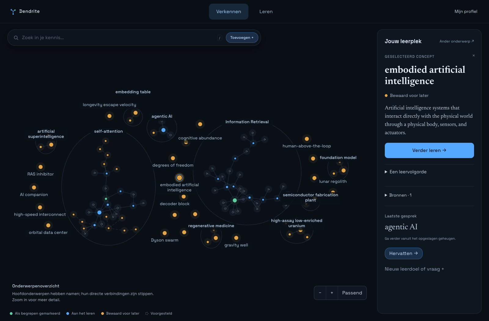
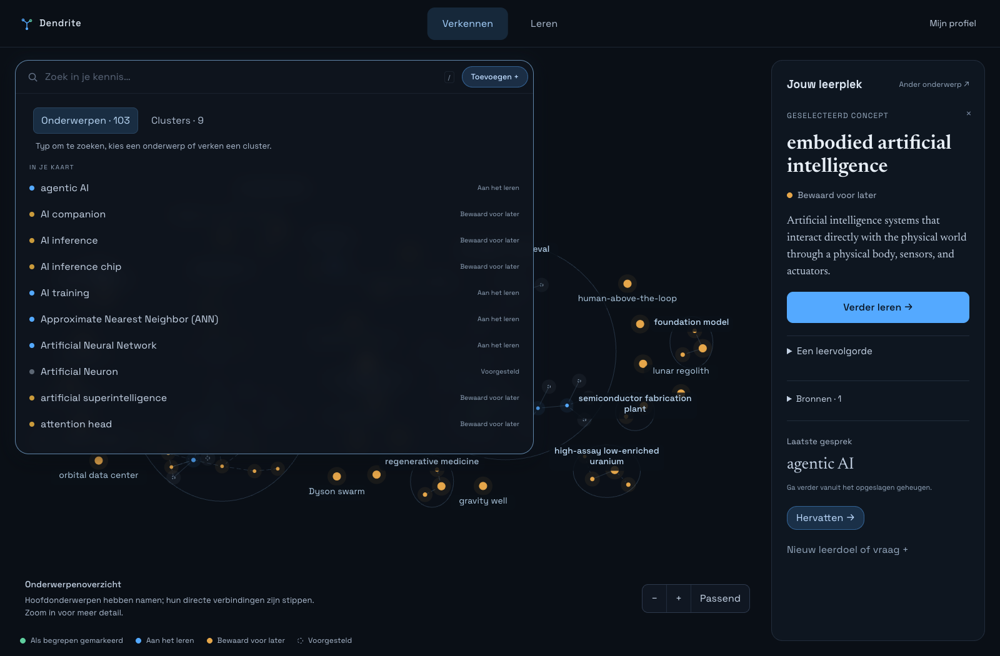
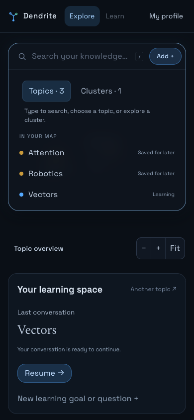

# Homepage — 14 september 2026

Beschikbaar op [localhost:3000](http://localhost:3000/).

- **Zoekveld:** klik voor een lijst van onderwerpen; typ om te zoeken of wissel
  naar Clusters. Clusterkeuze focust de graph. De focuschip wist de selectie.
- **Jouw leerplek:** één vaste rechterkolom voor de gekozen topic, laatste gesprek,
  hervatten, leerdoelen en een ander onderwerp kiezen. De laatste gesprekskaart
  wordt niet herhaald als dat al het geselecteerde onderwerp is.
- **Rustige graph:** geen blauwe focusrand door klikken of slepen met de muis.
  Toetsenbordbediening en een bescheiden toetsenbordfocus blijven beschikbaar.
- **Sluiten:** zoek-/toevoegkaart sluiten bij klikken of focus buiten de kaart;
  informatiepanelen sluiten bij een klik elders of Escape. Concepten klikken,
  pannen en zoomen blijven direct werken.
- **Mobiel:** het leerpaneel staat onder de graph en is afzonderlijk scrollbaar;
  zoeken blijft bovenaan. De compacte zoomuitleg toont de huidige detailtitel.

Browserchecks gebruiken geïsoleerde API-fixtures voor zoeken, clusterkeuze,
selectie/hervatten, menu’s, toetsenbord en mobiel. De fase 3-flow controleert ook
leerdoelen en mentorinteracties in de nieuwe indeling. Productiebuild geslaagd.
De onderstaande desktopbeelden gebruiken de echte dataset, alleen gelezen.
Geen wijzigingen in de backend of leerdata voor deze UX-aanpassing.

