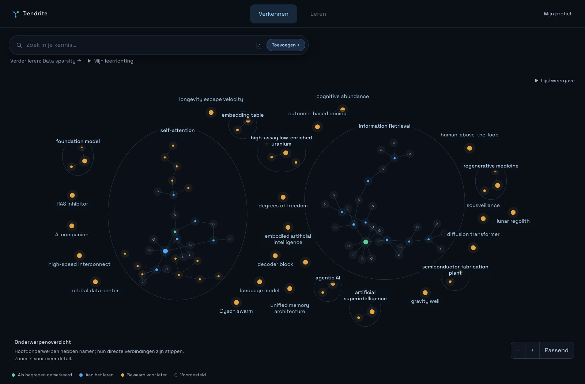
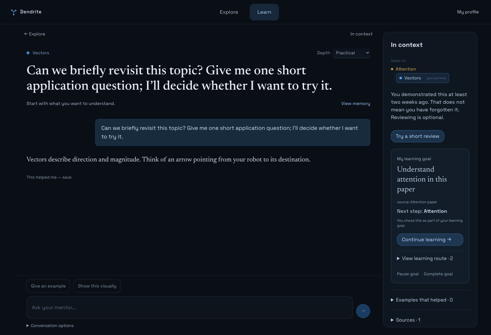
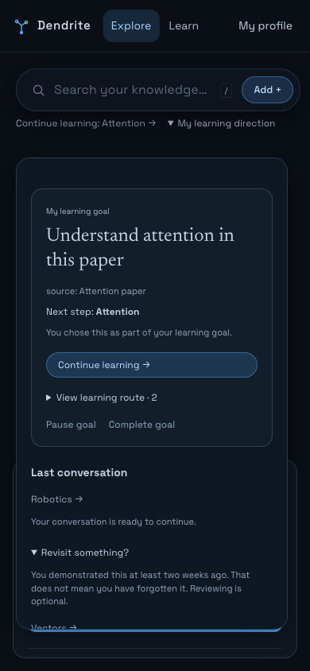

# Fase 3 — 13 september 2026

Beschikbaar op [localhost:3000](http://localhost:3000/). De bestaande dataset is
behouden. Kaartonderhoud (fase 4) en mentor-/ouderinstellingen (fase 5) volgen later.

## De twee navigatievragen

Zoeken vond concepten, de onderwerpdropdown focuste een cluster, en de conceptlijst
bood een alternatief voor de graph. Hun presentatie maakte het onderscheid te
klein. Zoeken blijft prominent. Clusterselectie gebeurt op de graph; de focuschip
wist de selectie. **Lijstweergave** is optioneel en toont dezelfde zoekresultaten.

De oude melding over “Leg uit” beschreef een ontbrekende opgeslagen relatie, niet
het ontbreken van relevante voorkennis. **Stel verbindingen voor** vraagt de mentor
nu expliciet om maximaal drie gemotiveerde voorstellen en een beginpunt. De
voorstelkaarten behouden Verkennen/Bewaren/Afwijzen. De knop start een gesprek;
hij voegt zelf geen voorgestelde concepten toe. De bestaande **Start de les**-flow
blijft uitleg geven en kan, zoals voorheen, voorkennisrelaties vastleggen.

## Proberen

1. Open **Mijn leerrichting** onder de zoekbalk. Maak een leerdoel of bewaarde vraag.
   Kies een bron en/of onderwerpen. Bij alleen een bron worden de bestaande
   onderwerpen uit die bron gebruikt.
2. Bekijk de route, open een stap en voer een gesprek. De mentor krijgt je doel,
   route en beschikbare broncontext mee. Zijpaden blijven mogelijk; gesprekken
   worden aan het actieve doel gekoppeld.
3. Vink een stap af wanneer je verder wilt. Pauzeer, hervat of voltooi het doel.
   Deze keuzes wijzigen geen zelfbeoordeling of bewijs. Eén doel is tegelijk actief.
4. Gebruik bij een mentorantwoord **Dit hielp mij — bewaar**. Bekijk en corrigeer
   het bij **Voorbeelden die hielpen**, of verwijder het. Het origineel blijft
   inspecteerbaar bij de correctie en in de gesprekslog.
5. Open bij een bron **Bespreek deze bron** voor een vraag over bewaarde fragmenten.
6. Als positief bewijs minimaal veertien dagen oud is, kan onder leerrichting
   **Nog eens bekijken?** verschijnen. Dit is optioneel en toont datum en citaat.
   Niets wordt automatisch als vergeten aangemerkt.

## Grenzen van deze fase

Routes zijn snapshots van bestaande gerichte voorkennisrelaties, geen automatisch
gegenereerd curriculum. Nieuwe onderwerpen vraag je in het gesprek aan en voeg je
via voorstelkaarten toe aan de graph. Ze veranderen een bewaarde route niet stilzwijgend;
maak zo nodig een nieuw doel met de nieuwe onderwerpen. Maximaal 60 stappen per doel;
kies bij grotere bronnen een kleinere selectie. Bij een cyclus wordt de onzekerheid
zichtbaar gemaakt en blijft de route vrij navigeerbaar.

De mentor motiveert vervolgstappen in het gesprek; routekaarten tonen opgeslagen
relatieredenen of dat een onderwerp zelf gekozen is. Zelf aangeven dat een voorbeeld
hielp is geen bewijs van algemene beheersing. Voorbeeldhergebruik is per concept;
profielgeheugen blijft daarnaast beschikbaar voor bredere voorkeuren.

Broncontext bestaat uit bewaarde fragmenten en samenvattingen. Er is geen nieuwe
volledige bronopslag, webophaling of garantie op modeljuistheid. De eerste versie
van terugblik gebruikt een transparante grens van veertien dagen en maximaal drie
voorstellen; dit is geen persoonlijk berekend herhaalschema.

## Validatie en data

- 35 backend-unitchecks en 12 frontendchecks geslaagd.
- Neo4j-fixtures controleren doel-/bron-/gesprekslinks, één actief doel, eigenaarschap,
  afvinken zonder statuswijziging, herhaald bewaren, correctie/verwijdering zonder
  verlies van originele berichten, en rollback bij ongeldige doelen.
- De Neo4j-tests van fase 2 blijven slagen, inclusief atomiciteit en rebuild.
- Browserflows controleren graph, mentor en fase 3: verbindingvoorstellen, bronvraag,
  voorbeelden, doelen, fout/retry, hervatten na herladen, terugblik en mobiel.
- Frontend-productiebuild geslaagd. Een synthetische echte modelcall onderscheidde
  het beschikbare citaat van algemene uitleg en benoemde ontbrekende broncontext.
- Backup vóór wijzigingen: `backups/before-phase3-2026-09-13.json` (lokaal privé).
  Alle 191 oorspronkelijke nodes en eigenschappen bleven tijdens de tests intact;
  tijdelijke fixtures zijn verwijderd. Geen reset en geen verwijdering van inhoud.
- Live Nederlandse homepage en de nieuwe read-only endpoints gecontroleerd.

Opt-in checks vanuit de projectmap:

```sh
docker compose run --rm --no-deps -T backend python -m tests.phase3_neo4j
# Deze extra check gebruikt een echte modelcall met uitsluitend synthetische data:
docker compose run --rm --no-deps -T backend python -m tests.phase3_model_check
```

## Screenshots

De homepage toont de echte behouden dataset. Mentor- en mobiele afbeeldingen
gebruiken geïsoleerde browserfixtures, geen toegevoegde leerdersdata.




